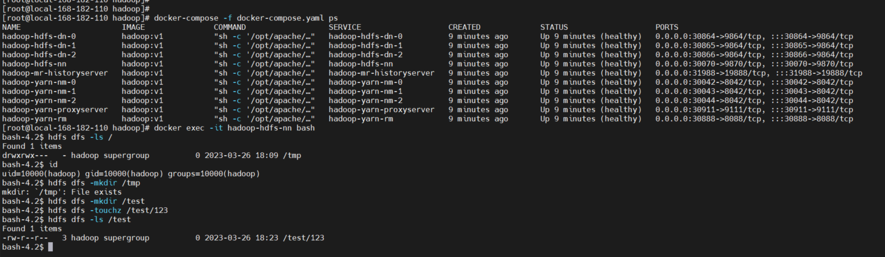
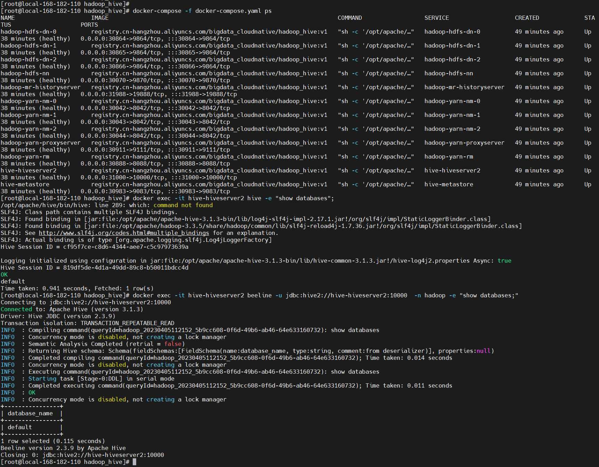

# docker-compose Hadoop 快速部署


### 1）安装 docker

```bash
# 安装yum-config-manager配置工具
yum -y install yum-utils

# 建议使用阿里云yum源：（推荐）
#yum-config-manager --add-repo https://download.docker.com/linux/centos/docker-ce.repo
yum-config-manager --add-repo http://mirrors.aliyun.com/docker-ce/linux/centos/docker-ce.repo

# 安装docker-ce版本
yum install -y docker-ce
# 启动并开机启动
systemctl enable --now docker
docker --version
```

### 2）安装 docker-compose

```bash
curl -SL https://github.com/docker/compose/releases/download/v2.16.0/docker-compose-linux-x86_64 -o /usr/local/bin/docker-compose

chmod +x /usr/local/bin/docker-compose
docker-compose --version
```

### 3）安装 git

```bash
yum -y install git
```

### 4）Hadoop 部署（非高可用）

```bash
git clone https://gitee.com/hadoop-bigdata/docker-compose-hadoop.git

cd docker-compose-hadoop/hadoop

# 开始部署
# 这里-f docker-compose.yaml可以省略，如果文件名不是docker-compose.yaml就不能省略，-d 后台执行
docker-compose -f docker-compose.yaml up -d

# 查看部署状态
docker-compose -f docker-compose.yaml ps
```



HDFS：`http://ip:30070/`

YARN：`http://ip:30070/`

### 5）Hadoop HA 部署（高可用）

```bash
# 如已下载可以忽略执行下载命令
git clone https://gitee.com/hadoop-bigdata/docker-compose-hadoop.git

cd docker-compose-hadoop/hadoop-ha

# 开始部署
# 这里-f docker-compose.yaml可以省略，如果文件名不是docker-compose.yaml就不能省略，-d 后台执行
docker-compose -f docker-compose.yaml up -d

# 查看部署状态
docker-compose -f docker-compose.yaml ps
```



HDFS：`http://ip:30070`  、`http://ip:30071` 

YARN：`http://ip:30888`、`http://ip:30889`

### 6）Hadoop Hive 部署（包括Hadoop）

#### 1、下载

```bash
git clone https://gitee.com/hadoop-bigdata/docker-compose-hadoop.git
```

#### 2、创建网络

```bash
# 创建，注意不能使用hadoop_network，要不然启动hs2服务的时候会有问题！！！
docker network create hadoop-network

# 查看
docker network ls
```

#### 3、部署 mysql5.7

```bash
cd docker-compose-hadoop/mysql

docker -f mysql-compose.yaml up -d

docker -f mysql-compose.yaml ps

#root 密码：123456，以下是登录命令，注意一般在公司不能直接在命令行明文输入密码，要不然容易被安全抓，切记，切记！！！
docker exec -it mysql mysql -uroot -p123456
```

#### 4、部署 Hadoop Hive

```bash
cd docker-compose-hadoop/hadoop_hive

docker-compose -f docker-compose.yaml up -d

# 查看
docker-compose -f docker-compose.yaml ps

# hive
docker exec -it hive-hiveserver2 hive -e "show databases";

# hiveserver2
docker exec -it hive-hiveserver2 beeline -u jdbc:hive2://hive-hiveserver2:10000  -n hadoop -e "show databases;"
```


上面只是快速部署的操作，如需详细教程，可关注我的公众号【大数据与云原生技术分享】，在公众号号里回复 **dch** 即可获取完整版教程~


